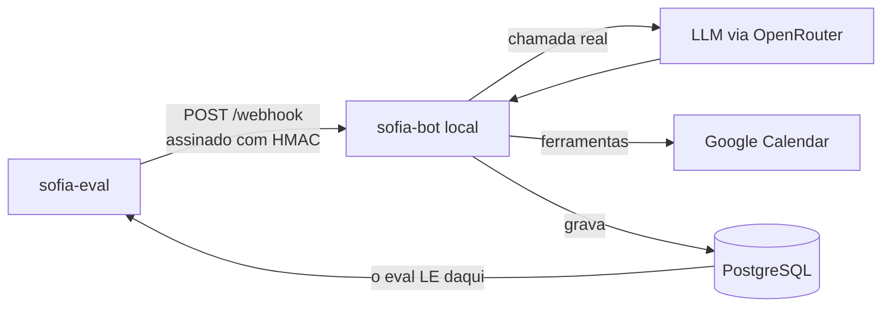
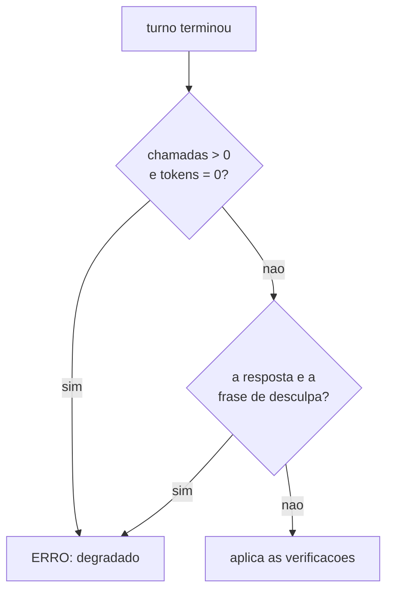

# sofia-eval — avaliação de comportamento de LLM

Avaliador que julga a decisão de um modelo de linguagem pelo rastro que ela deixa
no banco, e não pelo texto que ele escreveu. Ele monta o payload que a Meta
enviaria, assina com HMAC, ataca por HTTP um servidor de verdade com uma LLM de
verdade, e então abre o Postgres para perguntar: a linha nasceu? com que duração?
no nome de quem?

É a parte pública executável do projeto Sofia. O irmão
[`sofia-vitrine`](https://github.com/andrenv14/sofia-vitrine) mostra a
arquitetura do assistente; este mostra como eu provo que ele decide certo.

**No ar:** [riachotech.com.br](https://riachotech.com.br) ·
[@riacho_tech](https://www.instagram.com/riacho_tech/)

---

## 1. O que ele pega

O `sofia-bot` tem 47 arquivos / 694 testes em Vitest contra Postgres real, e eles
provam que o encanamento funciona: assinatura de webhook, dedup por `wamid`,
debounce do buffer, loop-guard, fila persistente. Neles a LLM é simulada, então o
que está sob teste é o código em volta do modelo.

O eval cobre a outra metade. Cada cenário nasce de um caso real:

| O que o cenário prova | Por que só um avaliador com IA real vê |
|---|---|
| Profissional de 60 min não recebe slots de 30 em 30 | O modelo omitia um campo *opcional*; o código estava correto |
| Confirmar vira linha em `appointments` | Escrever "agendado!" sem chamar a ferramenta não gera efeito nem exceção |
| A fala da dona da clínica não vira promessa da assistente | Depende de o modelo entender autoria |
| Saber o nome de alguém não autoriza cancelar o horário dela | É conduta, e só aparece na conversa inteira |

Uso definido: entra na verificação antes do lançamento de cliente novo, junto da
auditoria de segurança. O código de saída é `0`/`1`, então serve de portão.

## 2. Como funciona



A seta de baixo é a ideia inteira. O eval nunca lê a resposta do servidor para
julgar: ele lê o banco, que é um segundo ponto de verdade, independente do que o
modelo escreveu. Resposta de LLM não tem igualdade, mas quase tudo que importa
deixa rastro verificável. A linha existe em `appointments` ou não existe. A
duração é 60 ou é 30. O telefone confere ou não confere.

Um cenário é um arquivo YAML, e acrescentar um não exige tocar em código:

```yaml
id: agendamento-executa-nao-descreve
turnos:
  - "quero marcar um horário"
  - "pode ser na segunda-feira da semana que vem, de manhã"
  - "às 10h"
  - "confirma, meu nome é João Silva"
verificacoes:
  agendamentos: 1
  agendamento:
    duracao_minutos: 60
    telefone: contato
  chamadas_ia_max: 24
  tokens_prompt_max: 76766
```

Chave desconhecida no YAML derruba a execução antes do primeiro token, porque
verificação escrita errado que passa em silêncio é pior que verificação nenhuma.

## 3. A prova

São 16 cenários, todos com teto de custo medido, recalibrados em 07/09/2026
contra o commit que estava em produção, sob `google/gemini-3.7-flash`. As 48
passadas de cenário da recalibração correram sem uma única degradação, e os 16
tetos somam 975.438 tokens de prompt. Os três números de cada medição vivem no
comentário ao lado do teto, no YAML.

**O avaliador tem um avaliador.** `sofia_eval.autoteste` julga a camada que
decide PASSOU/FALHOU, que é onde um bug vira veredito errado em silêncio. São 41
casos exercidos nos dois sentidos: cada chave tem de passar quando deve e
reprovar quando deve. Segundos, zero token.

**Cenário que nasce verde não conta como guarda até ser visto vermelho.** Eu
quebro de propósito a condição que ele protege, e ele tem de reprovar; verde dos
dois jeitos significa que a asserção não mede o que afirma medir. Vale para o
autoteste também: quebrando a derivação que ele guarda, ele cai para 39/41 e
acusa os dois casos certos.

**Um vermelho não vira conclusão sem controle.** Quando um cenário passou a
falhar logo depois de uma branch nova, a leitura fácil era culpar a branch. Rodei
o mesmo cenário contra o código anterior, ele reproduziu o mesmo padrão, e a
hipótese caiu: a causa estava na interação entre dois cenários seguidos. Sem o
controle, uma branch correta teria sido barrada por um vermelho que não era dela.

**Uma decisão de produto foi sustentada de ponta a ponta.** Medi em 3 passadas
uma branch que enxugava o prompt de sistema: 18,2% menos tokens de prompt na
suíte inteira, 22,8% nos seis cenários mais antigos, sem regressão de
comportamento. Ela foi para produção com esses números na mão.

## 4. Mecanismos que valem leitura

### Assinatura igual à da plataforma

Não há atalho de "modo de teste" no servidor. O eval bate na mesma porta que a
Meta bateria, com a mesma assinatura. Se a verificação de HMAC quebrar, ele para
junto, que é o comportamento certo.

```python
def assinar(corpo: bytes, app_secret: str) -> str:
    """Espelha assinar() do sofia-bot."""
    return "sha256=" + hmac.new(app_secret.encode("utf-8"), corpo, hashlib.sha256).hexdigest()
```

### O turno acaba quando o banco diz que acabou

O servidor agrupa mensagens num buffer com debounce de 6 s. Consultar o banco
logo depois do `POST` lê estado incompleto, e mandar o turno seguinte cedo demais
faz o debounce fundir os dois num turno só, o que mediria outra conversa. Não há
`sleep` fixo em lugar nenhum: cada turno espera sair dos estados não-terminais da
fila, com timeout e falha explícita.

```python
FINAIS = ("concluida", "erro", "nao_enviada")
```

Os três vêm de leitura do servidor. `'nao_enviada'` é gravado em seis pontos
diferentes do processamento, e um cenário que a ignore espera por um estado que
nunca vem.

### De onde vem cada teto

Cada teto é 2 × o máximo observado em 3 passadas consecutivas, contra o modelo
declarado, e o comentário ao lado dele registra a data, o modelo, o commit e os
três números medidos. Nunca arredondo para número redondo, porque número redondo
esconde de onde veio.

A folga de 100% existe para pegar curva. Um incidente de laço consumiu 61
chamadas e 530.575 tokens de prompt, mais de dez vezes o custo típico, enquanto a
variação natural entre passadas é de ±1 chamada. Teto colado no valor típico
transforma variação normal em vermelho, e vermelho que dispara sozinho treina a
ignorar vermelho. Quando o prompt de sistema muda, refaço os tetos contra o
commit novo.

### Quando o modelo não responde

Se o modelo não respondeu, qualquer veredito seria sobre o silêncio dele, e
`agendamentos: 0` ficaria satisfeito por vacuidade. O eval detecta isso antes de
aplicar qualquer verificação.



São dois detectores porque um não cobre o outro. O primeiro pega o turno
inteiramente perdido; o segundo pega o parcialmente degradado, em que a primeira
iteração somou tokens de verdade e só a última falhou, e que para o primeiro é
indistinguível de um turno saudável. O segundo casa uma string literal do
servidor, então o autoteste exerce essa fragilidade nos dois sentidos.

## 5. Isolamento e dados

O eval recusa iniciar se a `DATABASE_URL` apontar para banco que não se chame
`sofia_test`, e trunca as tabelas entre cenários. O token da plataforma é falso,
então nada sai para a Meta; a resposta é lida de `messages`, onde o servidor
grava antes do envio, e por isso o envio falhar não afeta o julgamento. Todos os
nomes e telefones dos cenários são inventados, e o relatório e os despejos de
evidência ficam fora do repositório, porque conversa não entra em repositório em
nenhuma visibilidade.

O Google Calendar é real, de uma conta dedicada. Considerei um flag para trocá-lo
por um dublê e descartei: ligado por engano em produção, ele faria o agendamento
não chegar ao calendário do cliente sem ninguém perceber. Antes de apagar
qualquer evento, o eval confere que o refresh token pertence à conta declarada.
E ele não sobe servidor nem escolhe modelo, que são passos humanos declarados,
para que nenhuma rodada meça um modelo diferente do que se pensa medir.

## 6. Escopo

O eval mede decisão do modelo em conversa determinística, aferida por efeito no
banco. Volume e concorrência são outra categoria e ficam com a suíte e com o
loop-guard do próprio `sofia-bot`, inclusive o caso de dois robôs conversando
entre si, que é laço de infraestrutura e não escolha do modelo.

---

## Sobre este repositório

Repositório executável, e não de leitura: os 16 cenários, o avaliador e o
autoteste são o que roda antes de um cliente novo entrar no ar.

`requests`, `PyYAML`, `psycopg` e biblioteca padrão. ~3.300 linhas de Python.
Manual de operação, com instalação, vocabulário de verificação, formato dos
cenários e as armadilhas: [`docs/OPERACAO.md`](docs/OPERACAO.md).
