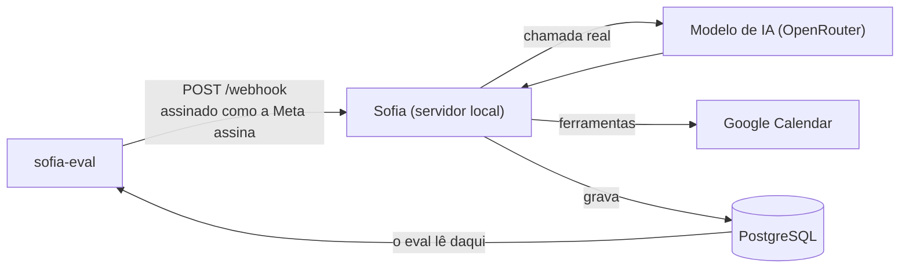
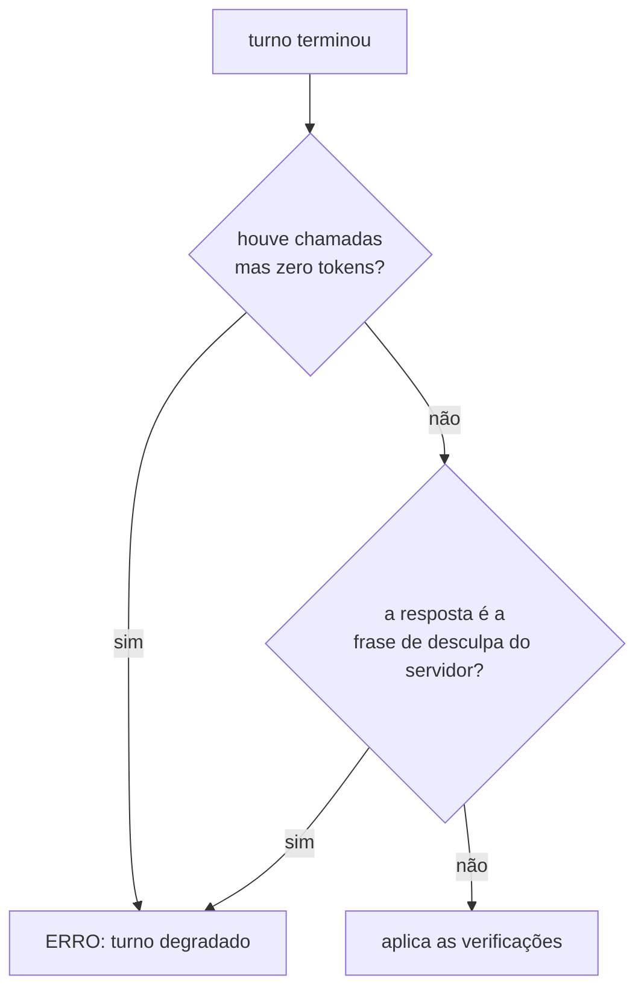

# sofia-eval — avaliação de comportamento de LLM

Avaliador que julga a decisão de um modelo de linguagem pelo rastro que ela
deixa no banco, e não pelo texto que ele escreveu. Ele monta a mensagem que a
Meta enviaria, assina como ela assinaria, envia para um servidor de verdade com
um modelo de verdade, e então abre o Postgres e pergunta: a linha nasceu? com
que duração? no nome de quem?

É a parte pública que roda do projeto Sofia. O irmão
[`sofia-vitrine`](https://github.com/andrenv14/sofia-vitrine) mostra a
arquitetura da assistente; este mostra como eu provo que ela decide certo.

**No ar:** [riachotech.com.br](https://riachotech.com.br) ([o código do site](https://github.com/andrenv14/riachotech-site)) ·
[@riacho_tech](https://www.instagram.com/riacho_tech/) ·
[`sofia-agents`](https://github.com/andrenv14/sofia-agents), o processo de trabalho por trás dos três.

---

## 1. O que ele pega

O `sofia-bot` tem mais de 700 testes em Vitest contra um Postgres real, e
todos simulam o modelo: eles provam o encanamento em volta dele, não a decisão dele.

O eval cobre a outra metade: o que o modelo decide. Cada cenário nasce de um
caso real.

| O que o cenário prova | Por que só um avaliador com IA real vê |
|---|---|
| Profissional de 60 min não recebe horários de 30 em 30 | O modelo omitia um campo *opcional*; o código estava correto |
| Confirmar vira uma linha em `appointments` | Escrever "agendado!" sem chamar a ferramenta não gera efeito nem erro |
| A fala da dona da clínica não vira promessa da assistente | Depende de o modelo entender quem escreveu |
| Saber o nome de alguém não autoriza cancelar o horário dela | É conduta, e só aparece na conversa inteira |

Ele roda antes de cada cliente novo entrar no ar, junto da auditoria de
segurança. Sai com código `0` ou `1`, então serve de portão.

## 2. Como funciona



A seta de baixo é a ideia inteira. O eval nunca lê a resposta do servidor para
julgar: lê o banco, que é um segundo ponto de verdade, independente do que o
modelo escreveu. Resposta de modelo não tem igualdade, mas quase tudo que
importa deixa rastro verificável. A linha existe em `appointments` ou não
existe. A duração é 60 ou é 30. O telefone confere ou não confere.

Um cenário é um arquivo YAML. Acrescentar um não exige tocar em código:

```yaml
id: agendamento-executa-nao-descreve
turnos:
  - "quero marcar um horário"
  - "pode ser na segunda-feira da semana que vem, de manhã"
  - "às 10h"
  - "confirma, meu nome é João Silva"
verificacoes:
  agendamentos: 1
  agendamento:
    duracao_minutos: 60
    telefone: contato
  chamadas_ia_max: 24
  tokens_prompt_max: 76766
```

Chave desconhecida no YAML derruba a execução antes do primeiro token.
Verificação escrita errado que passa em silêncio é pior que verificação
nenhuma.

## 3. A prova

São 16 cenários, todos com teto de custo medido, recalibrados contra o commit
que estava em produção, sob `google/gemini-3.7-flash` — e é o modelo, não a
data, que diz se um teto ainda vale. As 48
passadas da recalibração correram sem uma degradação, e os 16 tetos somam
975.438 tokens de prompt. Os três números de cada medição ficam no comentário
ao lado do teto, no YAML.

**O avaliador tem um avaliador.** `sofia_eval.autoteste` testa a camada que
decide PASSOU/FALHOU, que é onde um bug vira veredito errado em silêncio. São 41
casos nos dois sentidos: cada chave tem de passar quando deve e reprovar quando
deve. Leva segundos e não gasta token.

**Cenário verde só conta depois de ser visto vermelho.** Quebro de propósito a
condição que ele protege, e ele tem de reprovar. Verde dos dois jeitos
significa que a verificação não mede o que diz medir. Vale para o autoteste
também: quebrando a regra que ele guarda, ele cai para 39/41 e acusa os dois
casos certos.

**Um vermelho não vira conclusão sem controle.** Quando um cenário falha logo
depois de uma mudança, rodo o mesmo cenário contra o código anterior. Já
aconteceu de o vermelho se repetir lá, e a culpa não era da mudança.

**Uma decisão de produto foi medida de ponta a ponta.** Uma branch enxugava o
prompt de sistema. Em 3 passadas: 18,2% menos tokens de prompt na suíte
inteira, 22,8% nos seis cenários mais antigos, sem regressão de comportamento.
Ela foi para produção com esses números na mão.

## 4. Mecanismos que valem leitura

### Assinatura igual à da plataforma

Não há "modo de teste" no servidor. O eval bate na mesma porta que a Meta
bateria, com a mesma assinatura HMAC (um resumo criptográfico do corpo, feito
com o segredo do app). Se a verificação de assinatura quebrar, o eval para
junto, que é o comportamento certo.

```python
def assinar(corpo: bytes, app_secret: str) -> str:
    """Espelha assinar() do sofia-bot."""
    return "sha256=" + hmac.new(app_secret.encode("utf-8"), corpo, hashlib.sha256).hexdigest()
```

### O turno acaba quando o banco diz que acabou

O servidor espera 6 s para juntar as mensagens de um mesmo contato antes de
responder. Consultar o banco logo depois do envio lê um estado incompleto, e
mandar a mensagem seguinte cedo demais faz o servidor fundir as duas num turno
só, o que mediria outra conversa. Não há `sleep` fixo em lugar nenhum: cada
turno espera a fila sair dos estados intermediários, com tempo limite e falha
explícita.

```python
FINAIS = ("concluida", "erro", "nao_enviada")
```

Os três vêm de leitura do servidor. `'nao_enviada'` é gravado em todo ponto onde o
silêncio do dono ou uma falha impede a resposta de sair, e um cenário que a
ignore espera por um estado que nunca vem.

### De onde vem cada teto

Cada teto é 2× o máximo observado em 3 passadas seguidas, contra o modelo
declarado. O comentário ao lado dele registra a data, o modelo, o commit e os
três números medidos. Não arredondo, porque número redondo esconde de onde
veio.

A folga de 100% existe para pegar curva, não variação normal. Um laço consumiu
61 chamadas e 530.575 tokens de prompt, mais de dez vezes o custo típico,
enquanto a variação natural entre passadas é de ±1 chamada. Teto colado no
valor típico transforma variação normal em vermelho, e vermelho que dispara
sozinho ensina a ignorar vermelho. Quando o prompt de sistema muda, refaço os
tetos contra o commit novo.

### Quando o modelo não responde

Se o modelo não respondeu, qualquer veredito seria sobre o silêncio dele, e
`agendamentos: 0` passaria sem provar nada. O eval detecta isso antes de
aplicar qualquer verificação.



São dois detectores porque um não cobre o outro. O primeiro pega o turno
perdido inteiro. O segundo pega o parcialmente degradado, em que a primeira
tentativa somou tokens de verdade e só a última falhou, e que para o primeiro
parece um turno saudável. O segundo compara com uma frase literal do servidor,
então o autoteste exercita essa fragilidade nos dois sentidos.

## 5. Isolamento e dados

O eval se recusa a iniciar se a `DATABASE_URL` apontar para um banco que não se
chame `sofia_test`, e limpa as tabelas entre cenários. O token da plataforma é
falso, então nada sai para a Meta; a resposta é lida de `messages`, onde o
servidor grava antes de enviar, e por isso o envio falhar não afeta o
julgamento. Todos os nomes e telefones dos cenários são inventados. O relatório
e os despejos de evidência ficam fora do repositório, porque conversa não entra
em repositório em nenhuma visibilidade.

O Google Calendar é real, de uma conta dedicada, e não tem dublê: um "modo
teste" ligado por engano em produção faria o agendamento sumir do calendário do
cliente sem ninguém perceber. Antes de apagar qualquer evento, o eval confere
que a credencial pertence à conta declarada. E ele não sobe o servidor nem
escolhe o modelo: são passos humanos, para que nenhuma rodada meça um modelo
diferente do que se pensa medir.

## 6. Escopo

O eval mede a decisão do modelo em conversa determinística, aferida pelo efeito
no banco. Volume e concorrência são outra categoria e ficam com a suíte e com a
guarda contra laço do próprio `sofia-bot`, inclusive o caso de dois robôs
conversando entre si, que é laço de infraestrutura e não escolha do modelo.

---

## Sobre este repositório

Repositório que roda, não só de leitura: os 16 cenários, o avaliador e o
autoteste são o que executa antes de um cliente novo entrar no ar.

`requests`, `PyYAML`, `psycopg` e biblioteca padrão. ~3.300 linhas de Python.
Manual de operação, com instalação, vocabulário de verificação, formato dos
cenários e as armadilhas: [`docs/OPERACAO.md`](docs/OPERACAO.md).
