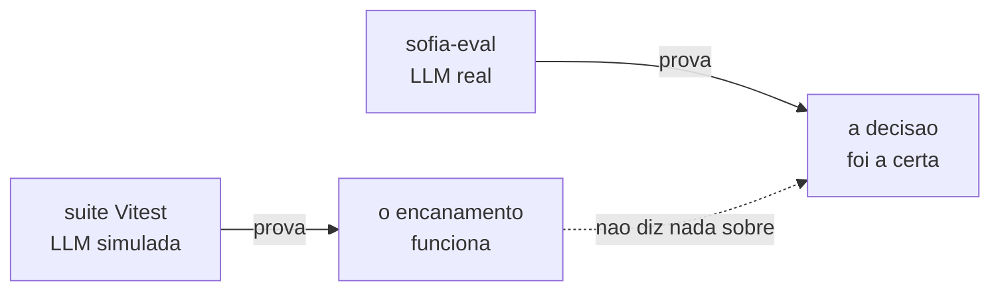
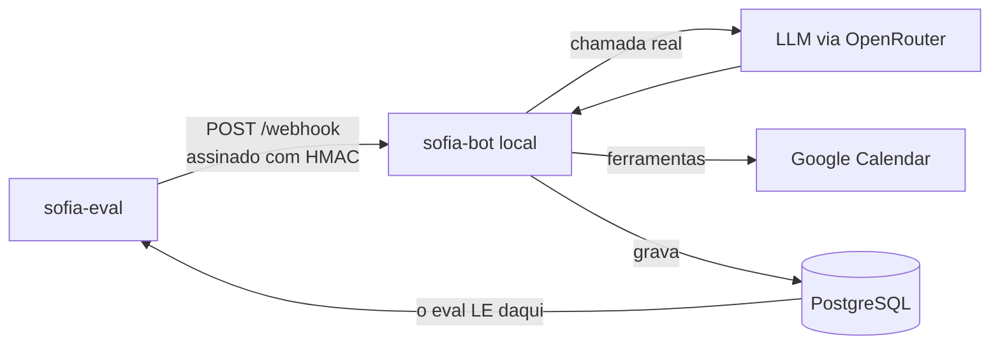
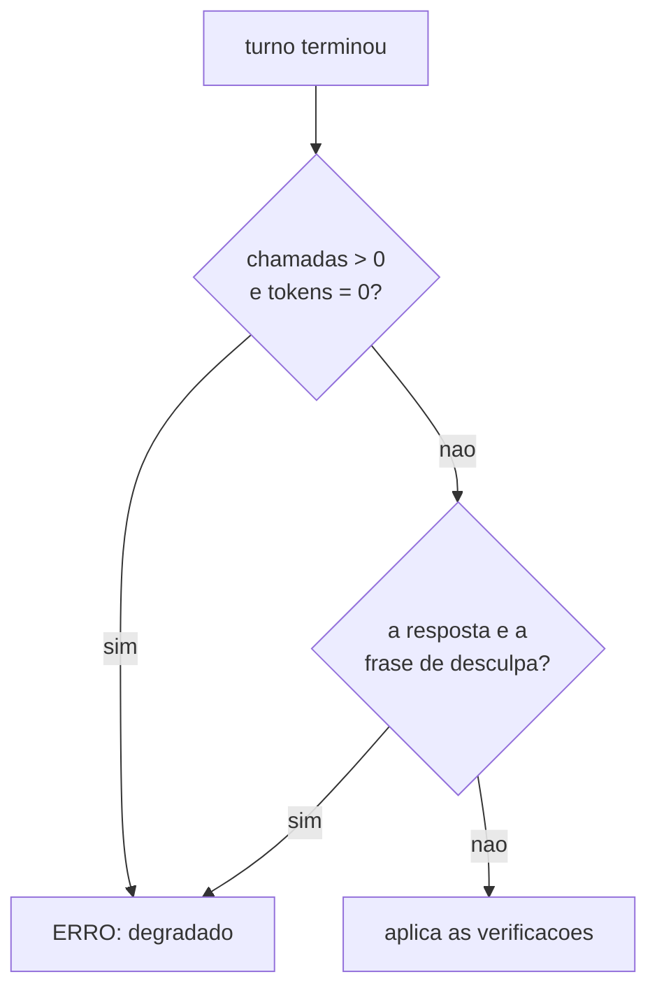

# sofia-eval — avaliação de comportamento de LLM

Avaliador que julga a decisão de um modelo de linguagem pelo **rastro que ela
deixa no banco** — nunca pelo texto que ele escreveu. Monta o payload que a Meta
enviaria, assina com HMAC como a plataforma assinaria, ataca por HTTP um
servidor de verdade com uma LLM de verdade, e então abre o Postgres para
perguntar: *a linha nasceu? com que duração? no nome de quem?*

É a parte pública **executável** do projeto Sofia. O repositório irmão
[`sofia-vitrine`](https://github.com/andrenv14/sofia-vitrine) mostra a
arquitetura do assistente; este mostra como se prova que ele decide certo.

**No ar:** [riachotech.com.br](https://riachotech.com.br) ·
[@riacho_tech](https://www.instagram.com/riacho_tech/)

---

## 1. O que ele pega que uma suíte de testes não pega

O `sofia-bot` tem 47 arquivos / 694 testes em Vitest contra Postgres real, e
eles provam que o **encanamento** funciona: assinatura de webhook, dedup por
`wamid`, debounce do buffer, loop-guard, fila persistente. Neles a LLM é
**simulada** — é o código em volta do modelo que está sob teste.

O eval cobre a outra metade, e cada cenário dele nasce de um caso real:

| O que o cenário prova | Por que só um avaliador com IA real vê isso |
|---|---|
| Profissional de 60 min não recebe slots de 30 em 30 | O modelo omitia um campo *opcional*; o código estava correto |
| Confirmar vira **linha em `appointments`**, não só texto | Escrever "agendado!" sem chamar a ferramenta não gera efeito nem exceção |
| A fala da dona da clínica não vira promessa da assistente | Depende de o modelo entender autoria, não de o código funcionar |
| Saber o nome de alguém não autoriza cancelar o horário dela | É decisão de conduta, e só aparece na conversa inteira |



Uso definido: entra na verificação **antes do lançamento de cliente novo**,
junto da auditoria de segurança. O código de saída é `0`/`1`, então serve de
portão.

## 2. Como funciona



A seta de baixo é a ideia inteira: o eval nunca lê a resposta do servidor para
julgar. Ele lê o **banco**, que é um segundo ponto de verdade, independente do
que o modelo escreveu.

Resposta de LLM não tem igualdade — mas quase tudo que importa deixa rastro
verificável: a linha existe em `appointments` ou não existe; a duração é 60 ou é
30; o telefone confere ou não confere. Julgar por efeito é escolha de desenho, e
é o que torna o veredito reprodutível.

Um cenário é um arquivo YAML, e acrescentar um **não exige tocar em código**:

```yaml
id: agendamento-executa-nao-descreve
turnos:
  - "quero marcar um horário"
  - "pode ser na segunda-feira da semana que vem, de manhã"
  - "às 10h"
  - "confirma, meu nome é João Silva"
verificacoes:
  agendamentos: 1
  agendamento:
    duracao_minutos: 60
    telefone: contato
  chamadas_ia_max: 24
  tokens_prompt_max: 76766
```

**Chave desconhecida no YAML é ERRO, não é ignorada.** Verificação escrita
errado que passa em silêncio é pior que verificação nenhuma — e a validação roda
em todos os arquivos antes do primeiro token ser gasto.

## 3. Como sei que funciona

**16 cenários, todos com teto de custo medido**, recalibrados em 07/09/2026
contra o commit que estava em produção, sob `google/gemini-3.7-flash`. As 48
passadas de cenário da recalibração (6 × 3 + 10 × 3) correram sem uma única
degradação. Os 16 tetos somam 975.438 tokens de prompt, todos contra o mesmo
prompt e o mesmo commit — a lista se rederiva com `--lista`, e os três números
de cada medição vivem no comentário ao lado do teto, no YAML.

**O avaliador tem um avaliador.** `sofia_eval.autoteste` julga a camada que
decide PASSOU/FALHOU, que é onde um bug não vira erro: vira veredito errado em
silêncio. 41 casos exercidos **nos dois sentidos** — cada chave tem de passar
quando deve e reprovar quando deve. Segundos, zero token.

**Cenário que nasce verde não conta como guarda até ser visto vermelho.** A
condição que ele protege é quebrada de propósito, e o cenário tem de reprovar;
verde dos dois jeitos significa que a asserção não mede o que afirma medir. O
mesmo vale para o próprio autoteste: quebrando de propósito a derivação que ele
guarda, ele cai de 41/41 para 39/41 e acusa exatamente os dois casos certos.

**Um vermelho não vira conclusão sem controle.** Quando um cenário passou a
falhar logo depois de uma branch nova, a leitura fácil era culpar a branch. O
controle — o mesmo cenário contra o código anterior — reproduziu o mesmo padrão,
e derrubou a hipótese. A causa real estava na interação entre dois cenários
seguidos, e a correção cabe em duas linhas:

```python
def phone_number_id_do_cenario(base: str, cenario_id: str) -> str:
    sufixo = int(hashlib.sha1(cenario_id.encode("utf-8")).hexdigest(), 16) % 10**6
    return f"{base}{sufixo:06d}"
```

Depois dela, o par de cenários que falhava 1 vez em 2 passou 4 de 4, sempre com
o mesmo custo. É o que o controle compra: sem ele, uma branch correta teria sido
barrada por um vermelho que não era dela.

**Uma decisão de produto foi sustentada de ponta a ponta.** Uma branch que
enxugava o prompt de sistema foi medida em 3 passadas: **−18,2%** de tokens de
prompt na suíte inteira, **−22,8%** nos seis cenários mais antigos, sem
regressão de comportamento. Foi para produção com esses números na mão.

## 4. Mecanismos que valem leitura

### Assina como a plataforma assinaria

Não há atalho de "modo de teste" no servidor. O eval bate na mesma porta que a
Meta bateria, com a mesma assinatura — se a verificação de HMAC do servidor
quebrar, o eval para junto, que é o comportamento certo.

```python
def assinar(corpo: bytes, app_secret: str) -> str:
    """Espelha assinar() do sofia-bot."""
    return "sha256=" + hmac.new(app_secret.encode("utf-8"), corpo, hashlib.sha256).hexdigest()
```

### Espera por sinal, nunca por tempo

O servidor agrupa mensagens num buffer com debounce de 6 s. Consultar o banco
logo depois do `POST` lê estado incompleto; mandar o turno seguinte cedo demais
faz o debounce **fundir os dois num turno só** — e aí o cenário mede outra
conversa. Não há `sleep` fixo em lugar nenhum: cada turno espera sair dos
estados não-terminais da fila, com timeout e falha explícita.

```python
FINAIS = ("concluida", "erro", "nao_enviada")
```

Os três vêm de leitura do servidor, não de suposição: `'nao_enviada'` é gravado
em seis pontos diferentes do processamento, e um cenário que a ignore espera por
um estado que nunca vem.

### Teto de custo medido, nunca chutado

Cada cenário carrega um teto de chamadas e de tokens. Ele é **2 × o máximo
observado em 3 passadas consecutivas**, contra o modelo declarado, e o
comentário ao lado dele diz a data, o modelo, o commit e os três números
medidos. Nunca se arredonda para número redondo: número redondo esconde de onde
veio.

A folga de 100% é dimensionada para pegar **curva**, não variação. Um incidente
de laço consumiu 61 chamadas e 530.575 tokens de prompt, mais de dez vezes o
custo típico de um cenário; já a variação natural entre passadas é de ±1
chamada. Teto colado no valor típico transforma variação normal em vermelho, e
vermelho que dispara sozinho treina a ignorar vermelho.

**A folga é remedida quando o prompt muda.** Depois de uma fatia que mexeu no
prompt de sistema, os 16 tetos foram refeitos contra o commit novo, e a folga de
cada um voltou a ser 2× medido — é o que mantém o teto capaz de acusar uma
regressão de custo em vez de virar conta no fim do mês.

### Turno degradado é ERRO, não é veredito

Se o modelo não respondeu, qualquer veredito seria sobre o silêncio dele — e
`agendamentos: 0` fica satisfeito por vacuidade, o que faria um cenário passar
sem ter provado nada. O eval detecta isso **antes** de aplicar qualquer
verificação.



São **dois** detectores porque um não cobre o outro, e isso foi medido. O
primeiro pega o turno inteiramente perdido. O segundo pega o turno
*parcialmente* degradado — a primeira iteração somou tokens de verdade e só a
última falhou —, que para o primeiro é indistinguível de um turno saudável.

O segundo é um contorno declarado: casa uma string literal do servidor, e o
autoteste exerce a fragilidade nos dois sentidos, inclusive o quase-acerto — a
mesma frase sem um acento **não pode** acusar.

### Transferir medição entre commits exige o hash, não a mensagem

"Medi o commit X, e o que está em produção é Y — a medição vale?" A única
resposta honesta compara o **código** dos dois lados, sem comentários:

```bash
for sha in <SHA-medido> <SHA-em-producao>; do
  h=$(git ls-tree -r $sha --name-only src/ \
      | while read f; do git show $sha:$f \
      | grep -vE "^[[:space:]]*(//|\*|/\*|\*/)"; done | md5sum)
  echo "$sha  $h"
done
```

Hashes iguais: a medição vale para os dois. Diferentes: vale só para o que foi
medido, mesmo que o diff "pareça" inócuo. Isso já poupou uma rodada inteira —
entre a medição e a produção havia três commits, um deles com título que qualquer
leitor classificaria como comportamental, e os hashes eram iguais: só comentário
tinha mudado. Título de commit é intenção declarada; hash é o que está lá.

## 5. Isolamento e dados

Nada disto é preferência — cada regra existe porque a ausência dela seria um
erro caro e silencioso.

- **Banco `sofia_test`, nunca o de produção.** O eval trunca tabelas entre
  cenários e **recusa iniciar** se a `DATABASE_URL` apontar para qualquer banco
  com outro nome.
- **Token da plataforma falso.** Nenhuma mensagem sai para a Meta em hipótese
  nenhuma. A resposta é lida de `messages`, onde o servidor grava **antes** do
  envio — então o envio falhar é irrelevante para o julgamento.
- **Conta do Google dedicada, e conferida antes de apagar.** O eval limpa
  eventos da janela de trabalho entre cenários; antes de apagar qualquer coisa
  confere que o refresh token pertence à conta declarada. Se não bater, recusa
  rodar.
- **Calendário real, e não um dublê.** Um flag que trocasse o Google por um mock
  poderia ser ligado por engano em produção e fazer o agendamento não chegar ao
  calendário do cliente **em silêncio**. Erro silencioso é pior que crash.
- **Todos os dados dos cenários são fictícios.** Nomes e telefones foram
  inventados para esta suíte; nenhum veio de cliente, paciente ou funcionário
  real.
- **Conversa não entra em repositório, em nenhuma visibilidade.** O relatório
  HTML e os despejos de evidência de falha são escritos numa pasta fora do
  repositório, de propósito.
- **O eval não sobe servidor e não escolhe modelo.** As duas coisas são passos
  humanos e declarados, para que nenhuma rodada meça um modelo diferente do que
  se pensa estar medindo.

## 6. Escopo

O eval mede **decisão do modelo em conversa determinística**, aferida por efeito
no banco. Volume e concorrência são outra categoria, e ficam com a suíte e com o
loop-guard do próprio `sofia-bot` — inclusive o caso de dois robôs conversando
entre si, que é laço de infraestrutura e não escolha do modelo.

---

## Sobre este repositório

Repositório executável, e não de leitura: os 16 cenários, o avaliador e o
autoteste são o que roda de verdade antes de um cliente novo entrar no ar. O
irmão [`sofia-vitrine`](https://github.com/andrenv14/sofia-vitrine) mostra a
arquitetura do assistente que este avalia.

`requests`, `PyYAML`, `psycopg` e biblioteca padrão. ~3.300 linhas de Python.

**Manual de operação** — instalação, isolamento, vocabulário de verificação,
formato dos cenários e as armadilhas: [`docs/OPERACAO.md`](docs/OPERACAO.md).
