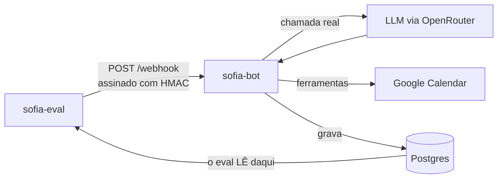

# sofia-eval

**Um avaliador que julga a decisão de um modelo de linguagem pelo rastro que ela
deixa no banco — nunca pelo texto que ele escreveu.**

Ele monta o payload que a Meta enviaria, assina com HMAC como a plataforma
assinaria, ataca por HTTP um `sofia-bot` de verdade com uma LLM de verdade, e
depois abre o Postgres para perguntar: *a linha nasceu? com que duração? no nome
de quem?*

Companheiro do [`sofia-vitrine`](https://github.com/andrenv14/sofia-vitrine), que
mostra a arquitetura do assistente. Este repositório é sobre como se prova que
ele funciona.

---

## O problema que ele existe para resolver

O `sofia-bot` tem uma suíte Vitest grande — 47 arquivos — que prova que o
**encanamento** funciona: assinatura de webhook, dedup por `wamid`, debounce do
buffer, loop-guard, fila persistente. Em todos esses testes a LLM é **simulada**.

E é exatamente por isso que nenhum deles pegou os bugs que mais custaram:

| Bug real | Por que a suíte não pegou |
|---|---|
| Profissional de 60 min recebendo slots de 30 em 30 — dois pacientes na mesma cadeira | O modelo omitia um campo *opcional*; o código estava correto |
| A Sofia escrever "agendado!" **sem chamar a ferramenta** | Nenhum efeito, nenhuma exceção — só texto |
| A Sofia tratar a fala da dona da clínica como promessa própria e confirmar um horário que ninguém verificou | O histórico gravava a fala do dono como se fosse dela |

Os três são **decisão do modelo**. Simular a LLM apaga precisamente o que
precisa ser observado.


---

## Como funciona



A seta de baixo é a ideia inteira: o eval nunca lê a resposta do servidor para
julgar. Ele lê o **banco**, que é um segundo ponto de verdade, independente do
que o modelo escreveu.

Um cenário é um arquivo YAML. Acrescentar um não exige tocar em código:

```yaml
id: agendamento-executa-nao-descreve
turnos:
  - "quero marcar um horário"
  - "pode ser na segunda-feira da semana que vem, de manhã"
  - "às 10h"
  - "confirma, meu nome é João Silva"
verificacoes:
  agendamentos: 1
  agendamento:
    duracao_minutos: 60
    telefone: contato
  chamadas_ia_max: 24
  tokens_prompt_max: 76766
```

---

## A prova de que funciona

Números medidos em **2026-09-07**, contra o `sofia-bot` que estava em produção,
sob `google/gemini-3.7-flash`:

- **16 cenários**, cada um com teto de custo medido em 3 passadas consecutivas;
- **48 passadas de cenário** na recalibração (6 × 3 + 10 × 3) sem uma única
  degradação — nem por limite de requisição, nem por esgotamento de iteração;
- **41/41** casos no autoteste — a camada que verifica o verificador;
- os 16 tetos somam **975.438 tokens de prompt**, todos calibrados contra o
  mesmo prompt e o mesmo commit.

E, no mesmo dia, o eval sustentou uma decisão de produto de ponta a ponta: uma
branch que enxugava o prompt de sistema foi medida em 3 passadas, entregou
**−18,2% de tokens de prompt** na suíte inteira e **−22,8%** nos seis cenários
mais antigos, sem regressão de comportamento — e foi para produção com esses
números na mão.

### O que ele pegou que ninguém tinha visto

Um cenário começou a falhar de forma intermitente. A hipótese óbvia era que a
branch nova tinha quebrado uma regra do prompt. Um controle contra a branch
anterior mostrou o mesmo padrão de falha — logo, não era a branch.

A causa era o próprio avaliador: o `sofia-bot` guarda o tenant em cache por 30
segundos, indexado pelo `phone_number_id`, e o eval usava **um só** para todos os
cenários. O cenário seguinte era atendido com a configuração do anterior. Como o
`TRUNCATE ... RESTART IDENTITY` faz o `id` do tenant voltar sempre a 1, o que
saía era um híbrido: as **colunas** do cenário anterior sobre os **dados** do
cenário atual.

O sintoma era indistinguível de um bug do modelo — e tinha contaminado, sem
ninguém notar, dois controles de sensibilidade em que decisões já tinham sido
tomadas. Ambos foram refeitos: um se sustentou, o outro não.

A correção cabe em duas linhas:

```python
def phone_number_id_do_cenario(base: str, cenario_id: str) -> str:
    sufixo = int(hashlib.sha1(cenario_id.encode("utf-8")).hexdigest(), 16) % 10**6
    return f"{base}{sufixo:06d}"
```

O caro não foi consertar. Foi descobrir.

---

## Mecanismos que valem leitura

### 1. Assina como a plataforma assinaria

Não há atalho de "modo de teste" no servidor. O eval bate na mesma porta que a
Meta bateria, com a mesma assinatura — se a verificação de HMAC do `sofia-bot`
quebrar, o eval para junto, que é o comportamento certo.

```python
def assinar(corpo: bytes, app_secret: str) -> str:
    """Espelha assinar() do sofia-bot."""
    return "sha256=" + hmac.new(app_secret.encode("utf-8"), corpo, hashlib.sha256).hexdigest()
```

### 2. Espera o efeito, nunca dorme um tempo fixo

O `sofia-bot` agrupa mensagens num buffer com debounce. Consultar o banco logo
depois do `POST` lê estado incompleto; mandar o turno seguinte cedo demais faz o
debounce **fundir os dois num turno só** — e aí o cenário mede outra conversa.

O eval espera cada turno sair dos estados não-terminais da fila:

```python
FINAIS = ("concluida", "erro", "nao_enviada")
```

`'nao_enviada'` faltou nessa tupla até ser descoberto que o `sofia-bot` a grava
em seis pontos diferentes. Sem ela, um cenário em que o loop-guard cortava
esperava até o timeout e saía como erro de infraestrutura — por algo que não
tinha nada a ver com o que ele mede.

### 3. Teto de custo medido, nunca chutado

Cada cenário carrega um teto de chamadas e de tokens. Ele é **2 × o máximo
observado em 3 passadas consecutivas**, contra o modelo declarado, e o
comentário ao lado dele no YAML diz a data, o modelo, o commit e os três números
medidos. Nunca se arredonda para número redondo: número redondo esconde de onde
veio.

A folga de 100% não é frouxidão — é dimensionada para pegar **curva**. O
incidente que motivou a guarda consumiu 61 chamadas e 530.575 tokens de prompt,
mais de dez vezes o custo típico; já a variação natural entre passadas é de ±1
chamada.

**E a folga precisa ser remedida.** Em 07/09 descobriu-se que cinco dos seis
tetos mais antigos tinham caído para 1,46×–1,84×: o prompt de sistema cresceu ao
longo de semanas e os tetos ficaram parados. Nenhum tinha estourado — e esse é o
ponto. O modo de falha de um teto largo demais é **não acusar**. Ele não faz
barulho; some.

### 4. Turno degradado é ERRO, não é veredito

Se o modelo não respondeu, qualquer veredito seria sobre o silêncio dele. Pior:
`agendamentos: 0` fica satisfeito **por vacuidade**, e o cenário passa em verde
sem ter provado nada. Isso aconteceu de verdade.


São **dois** detectores, e um não substitui o outro. O primeiro pega o turno
inteiramente perdido. O segundo pega o turno *parcialmente* degradado — em que a
primeira iteração somou tokens de verdade e só a última falhou —, que o primeiro
não distingue de um turno saudável.

O segundo é um contorno declarado: ele casa uma **string literal** do
`sofia-bot`. Se alguém mudar aquele texto, o detector emudece sem avisar. Está
escrito no código, com data para morrer, e o autoteste exerce a fragilidade —
inclusive o quase-acerto (a mesma frase sem um acento **não pode** acusar).

### 5. Quem verifica o verificador

O eval julga o modelo. `sofia_eval.autoteste` julga o **eval** — a camada que
decide PASSOU/FALHOU, onde um bug não vira erro, vira *veredito errado em
silêncio*.

```bash
.venv/bin/python -m sofia_eval.autoteste     # 41/41, segundos, zero token
```

Ele exerce cada chave do vocabulário **nos dois sentidos**: tem de passar quando
deve e reprovar quando deve. E a regra vale para ele próprio: quebrando de
propósito a derivação do `phone_number_id`, o autoteste cai de 41/41 para 39/41 e
acusa exatamente os dois casos certos — enquanto o caso do determinismo continua
verde, que é a discriminação correta, porque uma constante *é* determinística.

A mesma disciplina se aplica aos cenários. Um cenário que nasce verde não conta
como guarda até que a condição que ele protege seja quebrada de propósito e ele
fique vermelho. Verde dos dois jeitos significa que a asserção não mede o que
afirma medir.

### 6. Transferir medição entre commits exige o hash, não a mensagem

"Medi o commit X, e o que está em produção é Y — a medição vale?" A única
resposta honesta compara o **código** dos dois lados, sem comentários:

```bash
for sha in <SHA-medido> <SHA-em-producao>; do
  h=$(git ls-tree -r $sha --name-only src/ \
      | while read f; do git show $sha:$f \
      | grep -vE "^[[:space:]]*(//|\*|/\*|\*/)"; done | md5sum)
  echo "$sha  $h"
done
```

Isso já evitou dois erros. Entre a medição e a produção havia três commits, um
deles intitulado *"o turno passa a depender da tabela products"* — que qualquer
leitor classificaria como comportamental. Os hashes eram **iguais**: só
comentário tinha mudado, e a medição valia. Sem o hash, ela teria sido descartada
e refeita.

O caso perigoso é o simétrico: um commit intitulado "ajuste de texto" que mexa
numa linha executável passa despercebido, e a medição fica atribuída a um código
que não foi medido. Título de commit é intenção declarada; hash é o que está lá.

---

## O que ficou de fora, e por quê

- **Julgar o conteúdo do texto.** Exigiria regex frágil ou um segundo modelo como
  juiz. Falso negativo de regex é silencioso — o modelo parafraseia e o cenário
  passa sem provar nada; e um modelo juiz é o mesmo tipo de artefato que está
  sob avaliação. Consequência aceita e escrita: guardrails que não deixam rastro
  no banco não são cobertos.
- **Teste de carga.** Outra categoria, outra ferramenta.
- **Servidor, API, contêiner.** O relatório é um arquivo HTML estático escrito em
  disco — sem dependências além da biblioteca padrão.
- **Rodar contra produção, sob qualquer condição.** O eval **recusa iniciar** se
  o banco não se chamar `sofia_test`, e confere a identidade da conta do Google
  antes de apagar qualquer evento.
- **Ferramentas chamadas pelo modelo, no relatório.** O banco não guarda essa
  informação. O relatório diz isso explicitamente em vez de inventar uma fonte.

---

## Notas de projeto

- **Todos os dados dos cenários são fictícios.** Nomes e telefones foram
  inventados para esta suíte; nenhum veio de cliente, paciente ou funcionário
  real. O token da Meta é falso — nada sai para a plataforma em nenhuma hipótese.
- **Conversas não entram no repositório.** O relatório HTML e os despejos de
  evidência vão para uma pasta fora do repositório, em qualquer visibilidade.
- **O eval não sobe servidor e não escolhe modelo.** As duas coisas são passos
  humanos e declarados, porque uma rodada que mede o modelo errado sem ninguém
  notar já aconteceu.

`requests`, `PyYAML`, `psycopg` e biblioteca padrão. ~3.300 linhas de Python.

**Manual de operação completo — instalação, isolamento, vocabulário de
verificação, formato dos cenários e armadilhas:**
[`docs/OPERACAO.md`](docs/OPERACAO.md).
