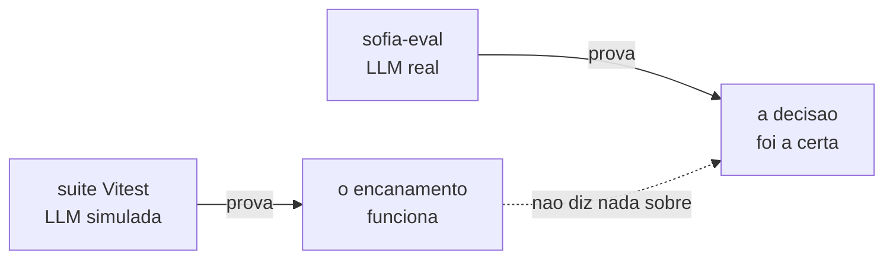
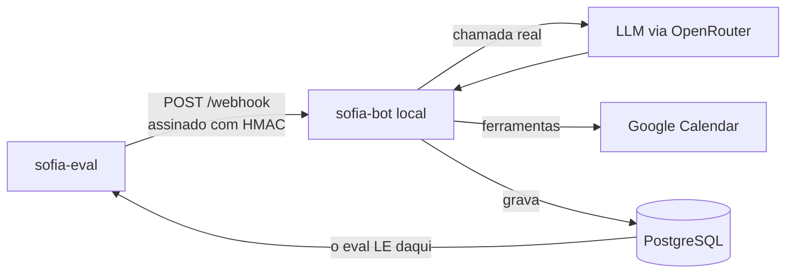
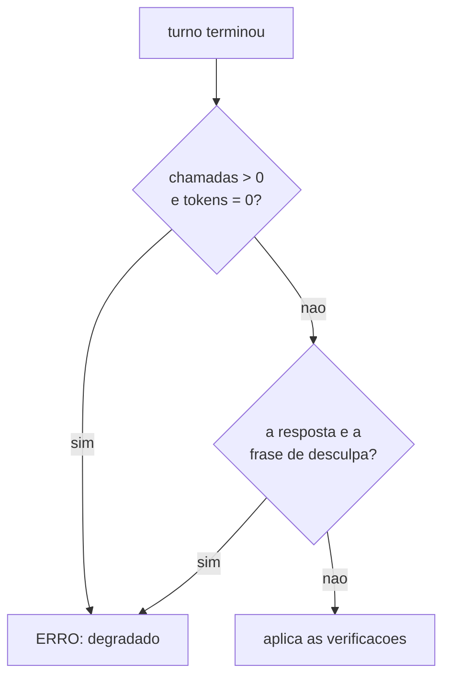

# sofia-eval — avaliação de comportamento de LLM

Avaliador que julga a decisão de um modelo de linguagem pelo **rastro que ela
deixa no banco** — nunca pelo texto que ele escreveu. Monta o payload que a Meta
enviaria, assina com HMAC como a plataforma assinaria, ataca por HTTP um
servidor de verdade com uma LLM de verdade, e então abre o Postgres para
perguntar: *a linha nasceu? com que duração? no nome de quem?*

É a parte pública **executável** do projeto Sofia. O repositório irmão
[`sofia-vitrine`](https://github.com/andrenv14/sofia-vitrine) mostra a
arquitetura do assistente; este mostra como se prova que ele decide certo.

**No ar:** [riachotech.com.br](https://riachotech.com.br) ·
[@riacho_tech](https://www.instagram.com/riacho_tech/)

---

## 1. Por que uma suíte de testes não resolve

O `sofia-bot` tem 47 arquivos / 694 testes em Vitest contra Postgres real, e
eles provam que o **encanamento** funciona: assinatura de webhook, dedup por
`wamid`, debounce do buffer, loop-guard, fila persistente. Neles a LLM é
**simulada** — é o código em volta do modelo que está sob teste.

Nenhum deles tinha como pegar os três bugs que mais custaram neste projeto:

| Bug real | Por que a suíte não pegou |
|---|---|
| Profissional de 60 min recebendo slots de 30 em 30 — dois pacientes na mesma cadeira | O modelo omitia um campo *opcional*; o código estava correto |
| A assistente escrever "agendado!" **sem chamar a ferramenta** | Nenhum efeito, nenhuma exceção — só texto |
| A assistente tratar a fala da dona da clínica como promessa própria e confirmar um horário que ninguém verificou | O histórico gravava a fala da dona sem marca de autoria |

Os três são **decisão do modelo**. Simular a LLM apaga exatamente o que precisa
ser observado.



Uso definido: entra na verificação **antes do lançamento de cliente novo**,
junto da auditoria de segurança. O código de saída é `0`/`1`, então serve de
portão.

## 2. Como funciona



A seta de baixo é a ideia inteira: o eval nunca lê a resposta do servidor para
julgar. Ele lê o **banco**, que é um segundo ponto de verdade, independente do
que o modelo escreveu.

Resposta de LLM não tem igualdade — mas quase tudo que importa deixa rastro
verificável: a linha existe em `appointments` ou não existe; a duração é 60 ou é
30; o telefone confere ou não confere.

Um cenário é um arquivo YAML, e acrescentar um **não exige tocar em código**:

```yaml
id: agendamento-executa-nao-descreve
turnos:
  - "quero marcar um horário"
  - "pode ser na segunda-feira da semana que vem, de manhã"
  - "às 10h"
  - "confirma, meu nome é João Silva"
verificacoes:
  agendamentos: 1
  agendamento:
    duracao_minutos: 60
    telefone: contato
  chamadas_ia_max: 24
  tokens_prompt_max: 76766
```

**Chave desconhecida no YAML é ERRO, não é ignorada.** Verificação escrita
errado que passa em silêncio é pior que verificação nenhuma — e a validação roda
em todos os arquivos antes do primeiro token ser gasto.

## 3. Como sei que funciona

**16 cenários, todos com teto de custo medido**, recalibrados em 07/09/2026
contra o commit que estava em produção, sob `google/gemini-3.7-flash`. As 48
passadas de cenário da recalibração (6 × 3 + 10 × 3) correram sem uma única
degradação. Os 16 tetos somam 975.438 tokens de prompt, todos contra o mesmo
prompt e o mesmo commit — a contagem se rederiva com `--lista` e os números de
cada um vivem no comentário ao lado do teto, no YAML.

**O avaliador tem um avaliador.** `sofia_eval.autoteste` julga a camada que
decide PASSOU/FALHOU, que é onde um bug não vira erro: vira **veredito errado em
silêncio**. 41 casos, segundos, zero token.

**Cenário que nasce verde não conta como guarda** até ser visto vermelho. A
condição que ele protege é quebrada de propósito, e o cenário tem de reprovar —
verde dos dois jeitos significa que a asserção não mede o que afirma medir. Dois
controles assim foram refeitos em 07/09, e o resultado foi desigual de propósito:
um se sustentou em 3 passadas limpas; o outro não sustentava o que se concluía
dele, e isso ficou escrito no cenário.

**Uma decisão de produto foi sustentada de ponta a ponta.** Uma branch que
enxugava o prompt de sistema foi medida em 3 passadas: **−18,2%** de tokens de
prompt na suíte inteira, **−22,8%** nos seis cenários mais antigos, sem
regressão de comportamento. Foi para produção com esses números na mão.

### O bug que o eval achou sobre si mesmo

Um cenário começou a falhar de forma intermitente, logo depois de uma branch
nova. A hipótese óbvia era que a branch tinha quebrado uma regra do prompt. Um
controle contra a branch anterior mostrou **o mesmo padrão de falha** — logo,
não era a branch.

A causa era o próprio avaliador. O servidor guarda o tenant em cache por 30
segundos, indexado pelo `phone_number_id`, e o eval usava **um só** para todos os
cenários — exatamente a chave do cache. O cenário seguinte era atendido com a
configuração do anterior. E como o `TRUNCATE ... RESTART IDENTITY` faz o `id` do
tenant voltar sempre a 1, o que saía não era "o cenário errado": era um híbrido,
as **colunas** do cenário anterior sobre os **dados** do cenário atual.

O sintoma era indistinguível de um bug do modelo — e tinha contaminado, sem
ninguém notar, dois controles em que decisões já haviam sido tomadas. A correção
cabe em duas linhas:

```python
def phone_number_id_do_cenario(base: str, cenario_id: str) -> str:
    sufixo = int(hashlib.sha1(cenario_id.encode("utf-8")).hexdigest(), 16) % 10**6
    return f"{base}{sufixo:06d}"
```

Depois dela, o par de cenários que falhava 1 vez em 2 passou 4 de 4, sempre com
o mesmo custo. O caro não foi consertar — foi descobrir, e é por isso que a
história está aqui em vez de só no histórico do git.

## 4. Mecanismos que valem leitura

### Assina como a plataforma assinaria

Não há atalho de "modo de teste" no servidor. O eval bate na mesma porta que a
Meta bateria, com a mesma assinatura — se a verificação de HMAC do servidor
quebrar, o eval para junto, que é o comportamento certo.

```python
def assinar(corpo: bytes, app_secret: str) -> str:
    """Espelha assinar() do sofia-bot."""
    return "sha256=" + hmac.new(app_secret.encode("utf-8"), corpo, hashlib.sha256).hexdigest()
```

### Espera por sinal, nunca por tempo

O servidor agrupa mensagens num buffer com debounce de 6 s. Consultar o banco
logo depois do `POST` lê estado incompleto; mandar o turno seguinte cedo demais
faz o debounce **fundir os dois num turno só** — e aí o cenário mede outra
conversa. Não há `sleep` fixo em lugar nenhum: cada turno espera sair dos
estados não-terminais da fila.

```python
FINAIS = ("concluida", "erro", "nao_enviada")
```

`'nao_enviada'` faltou nessa tupla até se descobrir que o servidor a grava em
seis pontos diferentes. Sem ela, um cenário em que o loop-guard cortava esperava
até o timeout e saía como erro de infraestrutura — por algo que não tinha nada a
ver com o que ele mede.

### Teto de custo medido, nunca chutado

Cada cenário carrega um teto de chamadas e de tokens. Ele é **2 × o máximo
observado em 3 passadas consecutivas**, contra o modelo declarado, e o
comentário ao lado dele diz a data, o modelo, o commit e os três números
medidos. Nunca se arredonda para número redondo: número redondo esconde de onde
veio.

A folga de 100% não é frouxidão — é dimensionada para pegar **curva**. O
incidente que motivou a guarda consumiu 61 chamadas e 530.575 tokens de prompt,
mais de dez vezes o custo típico de um cenário; já a variação natural entre
passadas é de ±1 chamada. Teto colado no valor típico transforma variação normal
em vermelho, e vermelho que dispara sozinho treina a ignorar vermelho.

**E a folga precisa ser remedida.** Em 07/09 uma medição de rotina encontrou
cinco dos seis tetos mais antigos com folga real entre 1,46× e 1,84×, não os 2×
que o comentário deles prometia: o prompt de sistema tinha crescido ao longo de
semanas e os tetos ficaram parados. Nenhum tinha estourado — e esse é o ponto. O
modo de falha de um teto largo demais é **não acusar**. Ele não faz barulho;
some.

### Turno degradado é ERRO, não é veredito

Se o modelo não respondeu, qualquer veredito seria sobre o silêncio dele. Pior:
`agendamentos: 0` fica satisfeito **por vacuidade**, e o cenário passa em verde
sem ter provado nada. Isso aconteceu de verdade, sob uma tempestade de HTTP 429.



São **dois** detectores, e um não substitui o outro — o que foi medido, não
previsto. O primeiro pega o turno inteiramente perdido. O segundo pega o turno
*parcialmente* degradado, em que a primeira iteração somou tokens de verdade e
só a última falhou: para o primeiro detector ele é indistinguível de um turno
saudável, e foi assim que o verde falso nasceu.

O segundo é um **contorno declarado**: ele casa uma string literal do servidor.
Se alguém mudar aquele texto, o detector emudece sem avisar. Está escrito no
código, com data para morrer, e o autoteste exerce a fragilidade — inclusive o
quase-acerto: a mesma frase sem um acento **não pode** acusar.

### Transferir medição entre commits exige o hash, não a mensagem

"Medi o commit X, e o que está em produção é Y — a medição vale?" A única
resposta honesta compara o **código** dos dois lados, sem comentários:

```bash
for sha in <SHA-medido> <SHA-em-producao>; do
  h=$(git ls-tree -r $sha --name-only src/ \
      | while read f; do git show $sha:$f \
      | grep -vE "^[[:space:]]*(//|\*|/\*|\*/)"; done | md5sum)
  echo "$sha  $h"
done
```

Isso já evitou dois erros no mesmo dia. Entre a medição e a produção havia três
commits, um deles intitulado *"o turno passa a depender da tabela products"* —
que qualquer leitor classificaria como comportamental. Os hashes eram **iguais**:
só comentário tinha mudado, e a medição valia. Sem o hash, ela teria sido
descartada e refeita.

O caso perigoso é o simétrico: um commit intitulado "ajuste de texto" que mexa
numa linha executável passa despercebido, e a medição fica atribuída a um código
que não foi medido. Título de commit é intenção declarada; hash é o que está lá.

## 5. Isolamento e dados

Nada disto é preferência — cada regra existe porque a ausência dela seria um
erro caro e silencioso.

- **Banco `sofia_test`, nunca o de produção.** O eval trunca tabelas entre
  cenários e **recusa iniciar** se a `DATABASE_URL` apontar para qualquer banco
  com outro nome.
- **Token da plataforma falso.** Nenhuma mensagem sai para a Meta em hipótese
  nenhuma. A resposta é lida de `messages`, onde o servidor grava **antes** do
  envio — então o envio falhar é irrelevante para o julgamento.
- **Conta do Google dedicada, e conferida antes de apagar.** O eval limpa
  eventos da janela de trabalho entre cenários; antes de apagar qualquer coisa
  ele confere que o refresh token pertence à conta declarada. Se não bater,
  recusa rodar.
- **Calendário real, e não um dublê.** Um flag que trocasse o Google por um mock
  poderia ser ligado por engano em produção e fazer o agendamento não chegar ao
  calendário do cliente **em silêncio**. Erro silencioso é pior que crash.
- **Todos os dados dos cenários são fictícios.** Nomes e telefones foram
  inventados para esta suíte; nenhum veio de cliente, paciente ou funcionário
  real.
- **Conversa não entra em repositório, em nenhuma visibilidade.** O relatório
  HTML e os despejos de evidência de falha são escritos numa pasta fora do
  repositório, de propósito.
- **O eval não sobe servidor e não escolhe modelo.** As duas coisas são passos
  humanos e declarados — uma rodada que mediu o modelo errado sem ninguém notar
  já aconteceu, e foi assim que a regra nasceu.

## 6. O que ficou de fora, e por quê

Cortar escopo é decisão de projeto, não falta dele.

**Julgar o conteúdo do texto.** Exigiria regex frágil ou um segundo modelo como
juiz. Falso negativo de regex é silencioso — o modelo parafraseia e o cenário
passa sem provar nada; e um modelo juiz é o mesmo tipo de artefato que está sob
avaliação, o que faz dele decisão própria e não detalhe de implementação.
Consequência aceita e escrita: guardrails que não deixam rastro no banco não são
cobertos por esta versão. O texto da resposta já é gravado, então a mudança é de
decisão, não de arquitetura.

**Teste de carga.** Simular volume para estressar o loop-guard é outra
categoria e outra ferramenta.

**Servidor, API, contêiner.** O relatório é arquivo HTML estático escrito em
disco — nenhuma dependência além da biblioteca padrão.

**Rodar contra produção, sob qualquer condição.** Não é "não recomendado": o
eval recusa iniciar.

**Ferramentas chamadas pelo modelo, no relatório.** O banco não guarda essa
informação. O relatório diz isso explicitamente em vez de inventar uma fonte.

---

## Sobre este repositório

Repositório executável, e não de leitura: os 16 cenários, o avaliador e o
autoteste são o que roda de verdade antes de um cliente novo entrar no ar. O
irmão [`sofia-vitrine`](https://github.com/andrenv14/sofia-vitrine) mostra a
arquitetura do assistente que este avalia.

`requests`, `PyYAML`, `psycopg` e biblioteca padrão. ~3.300 linhas de Python.

**Manual de operação** — instalação, isolamento, vocabulário de verificação,
formato dos cenários e as armadilhas: [`docs/OPERACAO.md`](docs/OPERACAO.md).
